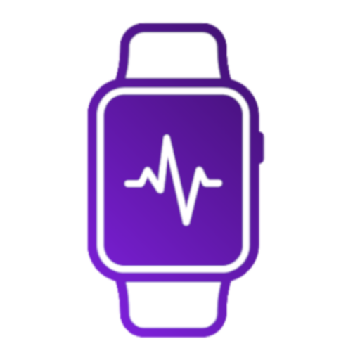
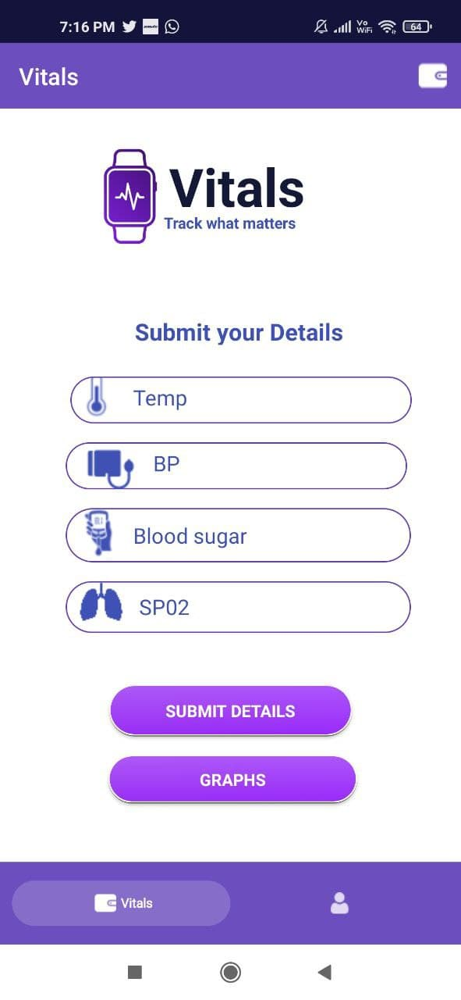
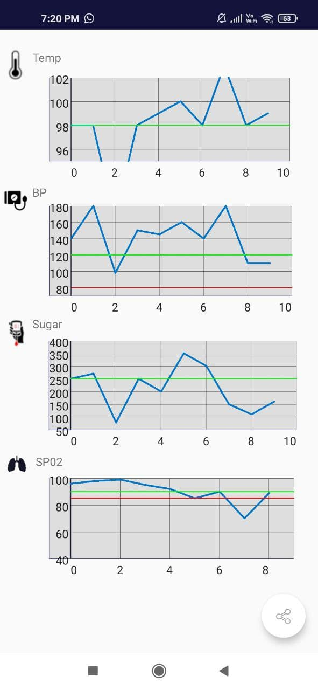

# Vitals  
## Track what matters

Demo version of app to track your vitals - Temp, BP, SP02, BP.

Track vitals over time, See graph representations.

New features to be added in future - 
1. Medical alerts
2. Drug tracking
3. Drug reminders
4. Camera based Auto-detection of readings
5. Customizable tracking parameters 

Kindly don't use for medical purposes or patient care. 

If interested in collaboration for this project, email me on - ap4.singh@gmail.com

## Goals - 

- [ ] Patient side of app
    - [x] Concept planning
    - [x] Basic Interface to collect data
    - [x] Signup and Login methods
    - [x] Connect to Google Firestore database
    - [x] Defict data in graphs
    - [x] Ability to delete all of your data
    - [ ] Add "Share reports" button
    - [ ] "Suggestions to improve app" button
- [ ] Doctor side of app
    - [ ] Track patient based on their id
    - [ ] Suggest medication changes in-app to patient
    - [ ] Alerts on patient tracking progress
    - [ ] Access to patient data - only on patient approval 

### Make the app smart - Add AI
- [ ] Camera based reading directly from BP/SP02 machine
- [ ] Medication reminders
- [ ] Tracking medications
- [ ] Confirm dosage changes from doctor

Frameworks used - 
- Android deployment - Java and Android Studio
- Database - Google Firestore database

App size ~ 8 mb 
Coverage of Android devices - more than 98% 

## Screenshots
| Home screen                  |  Graphs | 
| :---:                     |     :---:      |          
|  |    |
